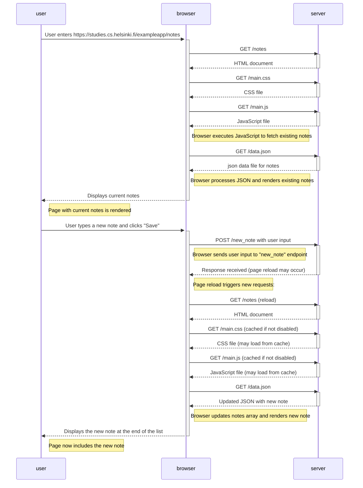

# New note sequence diagram 

 Excersise 4 part 0. 
Create a similar diagram that describes the situation where the user creates a new note on the page https://studies.cs.helsinki.fi/exampleapp/notes by typing something in the text field and clicking the Save button. 

 

