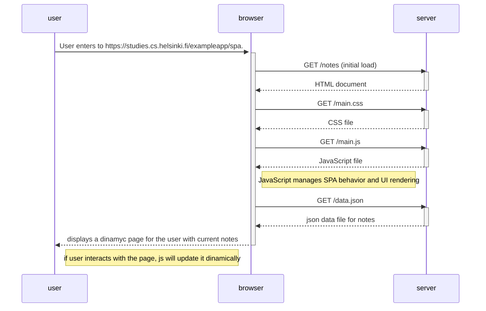

# Single-page application diagram  

 Excersise 5 part 0. 
Create a diagram that describes the situation where the user accesses the single-page app version of the notes app at https://studies.cs.helsinki.fi/exampleapp/spa. 

 

