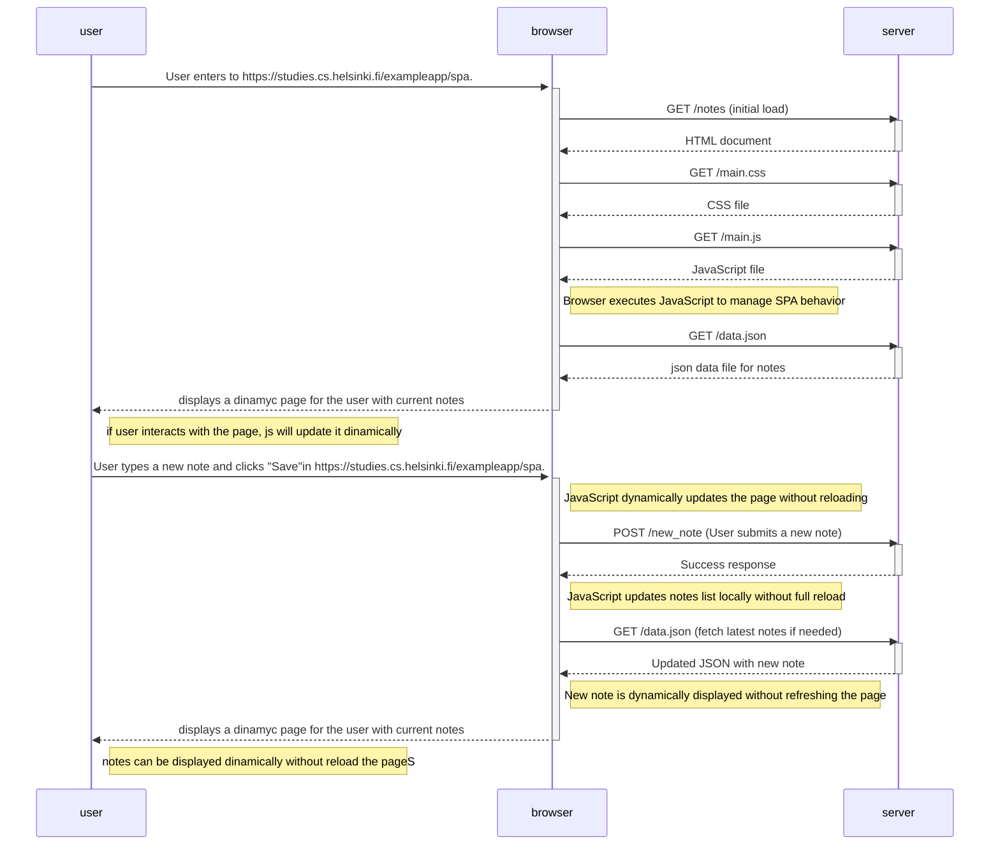

# New note in single-page application diagram

Excersise 6 part 0. 
Create a diagram that represents the situation where the user creates a new note using the single-page version of the application.

